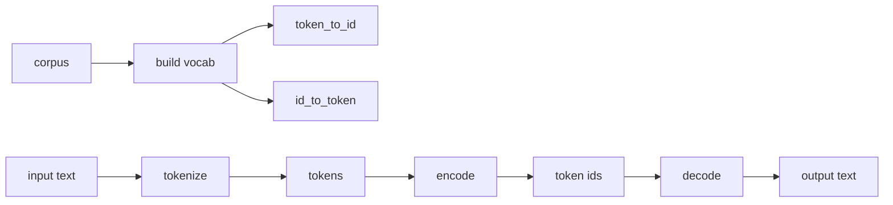

# Day 01: Tokenizer Basic

今天只做 tokenizer 的最小闭环，不碰 Hugging Face，也不碰 BPE。

目标不是实现一个现代 LLM tokenizer，而是先把 tokenizer 的骨架拆清楚：

```text
text
  -> tokenize(text)
tokens
  -> convert tokens to ids
token ids
  -> convert ids to tokens
tokens
  -> decode(ids)
text
```

现代 tokenizer 再复杂，也绕不开这个闭环。后面的 BPE、Byte-level BPE、SentencePiece、Qwen tokenizer、DeepSeek tokenizer、GLM tokenizer，本质上都是在这个骨架上增加更强的切分规则、更大的词表、更严格的特殊 token 协议和更快的工程实现。

## Module Split

Day01 只包含三个文件：

```text
day01_tokenizer_basic/
├── char_tokenizer.py
├── word_tokenizer.py
└── run_demo.py
```

职责边界：

| File | Role |
| --- | --- |
| `char_tokenizer.py` | 字符级 tokenizer。用于观察“几乎不 OOV，但序列更长”的问题。 |
| `word_tokenizer.py` | 粗糙 word-level tokenizer。用于观察“序列更短，但容易 `<unk>`，decode 难还原”的问题。 |
| `run_demo.py` | 对比两个 tokenizer 在中文、英文、代码、未知词上的行为。 |

不要在 Day01 引入 BPE、Hugging Face、模型权重、embedding 或训练逻辑。Day01 的边界必须保持很小。

## Facade Interface

两个 tokenizer 都应该暴露同一组接口。

```python
class TokenizerLike:
    pad_token: str
    unk_token: str
    bos_token: str
    eos_token: str

    pad_token_id: int
    unk_token_id: int
    bos_token_id: int
    eos_token_id: int

    @property
    def vocab_size(self) -> int: ...

    def tokenize(self, text: str) -> list[str]: ...

    def encode(
        self,
        text: str,
        add_special_tokens: bool = False,
    ) -> list[int]: ...

    def decode(
        self,
        ids: list[int],
        skip_special_tokens: bool = False,
    ) -> str: ...

    def convert_ids_to_tokens(self, ids: list[int]) -> list[str]: ...

    def convert_tokens_to_ids(self, tokens: list[str]) -> list[int]: ...
```

这里的 `TokenizerLike` 只是 README 里的接口说明，不需要你今天真的写成抽象基类。等后面多个 tokenizer 实现变多了，再考虑抽公共协议。

## Data Flow



核心点：

1. `corpus` 只负责构建词表。
2. `tokenize(text)` 只负责切文本，不负责转 id。
3. `encode(text)` 负责 `text -> tokens -> ids`。
4. `decode(ids)` 负责 `ids -> tokens -> text`。
5. 未知 token 必须映射到 `<unk>`。
6. `add_special_tokens=True` 时，`encode` 应该在首尾加 `<bos>` 和 `<eos>`。

## Special Tokens

Day01 固定使用这四个 special tokens：

| Token | Meaning |
| --- | --- |
| `<pad>` | padding token，用于未来批处理时补齐长度。Day01 暂时只保留概念。 |
| `<unk>` | unknown token，表示词表里不存在的字符或片段。 |
| `<bos>` | begin of sequence，序列开始。 |
| `<eos>` | end of sequence，序列结束。 |

建议固定顺序：

```python
special_tokens = ["<pad>", "<unk>", "<bos>", "<eos>"]
```

这样 id 稳定，测试也更容易写。

## CharTokenizer

字符级 tokenizer 的规则非常简单：

```text
"tokenizer" -> ["t", "o", "k", "e", "n", "i", "z", "e", "r"]
"我喜欢LLM" -> ["我", "喜", "欢", "L", "L", "M"]
```

实现逻辑：

1. 从 `corpus` 中收集所有出现过的字符。
2. 按稳定顺序构建 vocab。
3. 每个字符映射到一个 id。
4. 输入里遇到 corpus 中没出现过的字符时，映射为 `<unk>`。

需要观察的 tradeoff：

| Advantage | Cost |
| --- | --- |
| 不容易遇到未知词，只要字符见过就能编码。 | 英文、代码、长词会被切得很碎，token 序列变长。 |
| decode 通常更容易还原原文。 | 完全没有词根、词片段、代码结构的概念。 |

注意：如果一个汉字没有出现在 `corpus` 中，它仍然会变成 `<unk>`。字符级 tokenizer 不是永远没有未知 token。

## WordTokenizer

word-level tokenizer 这一天只做粗糙版本。

推荐正则：

```python
TOKEN_PATTERN = re.compile(r"\w+|[^\w\s]", re.UNICODE)
```

大致效果：

```text
"Hello, world!" -> ["Hello", ",", "world", "!"]
"def get_user_profile(user_id):" -> ["def", "get_user_profile", "(", "user_id", ")", ":"]
```

它的问题要故意暴露出来：

| Problem | Example |
| --- | --- |
| 词表外词会变成 `<unk>`。 | corpus 有 `token`，输入 `tokenization`，可能直接 OOV。 |
| decode 很难完美恢复空格。 | `Hello, world!` 可能还原成 `Hello , world !`。 |
| 对中文不友好。 | `\w+` 在 Python Unicode 正则下可能把连续中文当成一个片段。 |
| 对代码结构理解很浅。 | `get_user_profile` 只是一个正则片段，不是真正的语义切分。 |

这里不要为了“看起来聪明”去修太多规则。Day01 的目的就是让你看到 word-level tokenizer 为什么不够用。

## Demo Requirements

`run_demo.py` 应该构造一个小 corpus，至少包含：

1. 中文句子。
2. 英文句子。
3. LLM/tokenizer 技术词。
4. 一小段代码。

建议测试文本：

```python
TEST_TEXTS = [
    "我正在学习大模型。",
    "LLM tokenizer",
    "tokenizer",
    "tokenization",
    "def get_user_profile(user_id): return db.query(user_id)",
    "Hello, world!",
]
```

demo 输出至少包含：

| Column | Meaning |
| --- | --- |
| `text` | 原始输入文本。 |
| `tokens` | `tokenize(text)` 的结果。 |
| `ids` | `encode(text, add_special_tokens=True)` 的结果。 |
| `id_tokens` | `convert_ids_to_tokens(ids)` 的结果，用来直接观察 id 对应的 token。 |
| `decoded_keep` | `decode(ids, skip_special_tokens=False)` 的结果，保留 `<bos>` / `<eos>`。 |
| `decoded_skip` | `decode(ids, skip_special_tokens=True)` 的结果，跳过 `<bos>` / `<eos>` / `<pad>`。 |

推荐用 `rich.Table` 输出，方便肉眼对比。

运行命令：

```powershell
python -m llm_lab.day01_tokenizer_basic.run_demo
```

如果还没有安装为 editable package，需要先在项目根目录执行：

```powershell
pip install -e .
```

## What To Observe

跑 demo 时不要只看“有没有报错”，要看这些现象：

1. `CharTokenizer` 的 token 数通常比 `WordTokenizer` 多。
2. `CharTokenizer` 对 `tokenization` 会拆成很多字符。
3. `WordTokenizer` 遇到 corpus 里没有的完整词，容易得到 `<unk>`。
4. `WordTokenizer.decode()` 可能破坏原始空格和标点布局。
5. `<bos>` 和 `<eos>` 出现在 ids 中，`decoded_keep` 应该能看到它们。
6. `decoded_skip` 应该跳过 `<bos>` / `<eos>` / `<pad>`，但不应该跳过 `<unk>`。

## Automation

Day01 的回归测试放在：

```text
tests/
└── test_day01_tokenizer_basic.py
```

当前测试点：

1. `CharTokenizer.encode()` 和 `CharTokenizer.decode()` 对已知字符基本可逆。
2. `CharTokenizer` 遇到 unknown char 时会产生 `unk_token_id`。
3. `encode(add_special_tokens=True)` 会添加 `bos_token_id` 和 `eos_token_id`。
4. `decode(skip_special_tokens=True)` 会跳过结构 token，但不会跳过 `<unk>`。
5. `WordTokenizer.tokenize()` 能切出英文、标点、括号、代码 identifier。
6. `WordTokenizer` 的 vocab 必须从 `self.tokenize(corpus)` 构建，而不是从 `set(corpus)` 构建。

运行：

```powershell
powershell -ExecutionPolicy Bypass -File scripts\test.ps1
```

Day01 demo：

```powershell
powershell -ExecutionPolicy Bypass -File scripts\run_day01.ps1
```

脚本默认使用当前 Python 环境。若本机需要指定 conda 环境，可以临时设置：

```powershell
$env:LLM_LAB_CONDA_ENV='Ema'
powershell -ExecutionPolicy Bypass -File scripts\test.ps1
```

## Review Checklist

写完代码后，我会按这个清单 review：

1. API 是否和 README 的 facade 一致。
2. special token id 是否稳定。
3. unknown token 的处理是否明确。
4. `encode` 和 `decode` 是否职责清晰。
5. `WordTokenizer.decode()` 是否没有假装完美还原。
6. demo 是否能清楚暴露 char-level 和 word-level 的优缺点。
7. 测试是否覆盖 happy path 和 OOV path。

## Connection To Real Tokenizers

Day01 的 tokenizer 很朴素，但它已经对应真实 tokenizer 的核心概念：

| Day01 Concept | Real Tokenizer Concept |
| --- | --- |
| `token_to_id` | vocab |
| `id_to_token` | reverse vocab |
| `encode` | text to input ids |
| `decode` | output ids to text |
| `<bos>` / `<eos>` | sequence boundary tokens |
| `<unk>` | out-of-vocabulary fallback |
| `vocab_size` | embedding table row count |

真实工业 tokenizer 不是只有“词表 + tokenize 算法”。常见 pipeline 至少包括：

```text
normalizer
pre-tokenizer
tokenization model / vocab / merges
post-processor
decoder
special tokens
chat template
padding / truncation
```

后面 Day02 开始手写 BPE，才会进入现代 LLM tokenizer 的主线：

```text
统计相邻 pair
  -> 选择最高频 pair
  -> merge 成新 token
  -> 保存 merge rules
  -> 用 merge rules encode 新文本
```

Day04 再去看 Qwen、DeepSeek、GLM 的 tokenizer 文件，届时你会发现工业实现不是魔法，只是把这些基础概念做到了更大、更快、更严格。

## Day01 Self Check

下面是 Day01 收工前的自测题。重点不是背概念，而是能不能讲清楚 tokenizer 的工程边界。

### 1. `CharTokenizer` 和 `WordTokenizer` 最大的区别是什么？

`CharTokenizer` 的最小单位是字符，单位更小，所以更不容易 OOV，但序列会更长。`WordTokenizer` 的最小单位是正则切出来的片段，序列通常更短，但只要完整片段不在 vocab 里，就会变成 `<unk>`。

注意：字符级 tokenizer 也不是永远没有 OOV。只要某个字符没有出现在构建 vocab 的 corpus 里，它仍然会变成 `<unk>`。

### 2. 为什么 `WordTokenizer` 的 vocab 必须用 `self.tokenize(corpus)` 构建？

因为 vocab 的粒度必须和 `tokenize()` 的粒度一致。

如果用 `set(corpus)` 构建 vocab，本质上是在按字符建词表；但 `WordTokenizer.encode()` 又按 word token 查表。这样 `LLM`、`tokenizer`、`def`、`get_user_profile` 这类 token 都会查不到，最后大量变成 `<unk>`。

### 3. 代码文本会被 `WordTokenizer` 大概切成什么？

输入：

```python
"def get_user_profile(user_id): return db.query(user_id)"
```

预期 token：

```python
[
    "def",
    "get_user_profile",
    "(",
    "user_id",
    ")",
    ":",
    "return",
    "db",
    ".",
    "query",
    "(",
    "user_id",
    ")",
]
```

`get_user_profile` 会成为一个整体，因为 Python 正则里的 `\w+` 包含字母、数字和下划线。

### 4. 为什么 `<unk>` 不应该在 `skip_special_tokens=True` 时被跳过？

`<bos>`、`<eos>`、`<pad>` 是结构 token，可以在展示正文时跳过。`<unk>` 不是结构 token，它代表“这里原本有一个未知内容”。

如果 decode 时把 `<unk>` 删除，未知内容会直接消失，你会误以为原文里没有这块信息。

### 5. `encode(..., add_special_tokens=True)` 和 `decode(..., skip_special_tokens=True)` 分别控制什么？

`encode(text, add_special_tokens=True)` 控制输入侧：

```text
text -> tokens -> ids
```

并在首尾加 `<bos>` 和 `<eos>`。

`decode(ids, skip_special_tokens=True)` 控制输出侧：

```text
ids -> tokens -> text
```

并决定展示文本时是否跳过 `<bos>`、`<eos>`、`<pad>` 这类结构 token。

### 6. 为什么 `WordTokenizer.decode()` 很难完美还原原始文本？

因为 tokenize 以后，原始空格布局丢了。

例如：

```text
Hello, world!
```

tokens 是：

```python
["Hello", ",", "world", "!"]
```

如果 decode 用 `" ".join(tokens)`，会得到：

```text
Hello , world !
```

如果 decode 用 `"".join(tokens)`，会得到：

```text
Hello,world!
```

两者都不是原文。这就是为什么真实 tokenizer 的 decoder 要处理空格、标点、换行、缩进、byte fallback 和 Unicode。

### 7. 如果 `tokenize()` 输出粒度和 vocab 粒度不一致，会发生什么？

会系统性地产生大量 `<unk>`。

Day01 里最典型的 bug 是：`WordTokenizer.tokenize()` 输出 word token，但 vocab 却从 `set(corpus)` 的字符集合构建。代码能跑，但语义几乎全坏。

### 8. 真实 LLM tokenizer 除了“词表 + tokenize 算法”，还至少包括什么？

典型组成包括：

```text
normalizer
pre-tokenizer
tokenization model / vocab / merges
post-processor
decoder
special tokens
chat template
padding / truncation
```

不要把工业 tokenizer 理解成“一个正则 + 一个字典”。真实实现是一条 pipeline。

### 9. 为什么同一句 prompt 在 Qwen、DeepSeek、GLM 里 token 数可能不同？

因为它们的 vocab、merge rules、pre-tokenizer、special tokens、chat template 都可能不同。同样一段文本，切分粒度和结构包装不同，最后 token 数自然不同。

### 10. Day01 这几个 pytest 最重要保护哪个 bug？

最重要保护的是 `WordTokenizer` 的 vocab 粒度 bug。

这个 bug 比普通 typo 更危险，因为代码表面能运行，demo 也会输出 ids，但大量语义 token 都变成 `<unk>`。这类 bug 会让 tokenizer 看起来“可用”，实际已经失去学习价值。

### 11. Naive BPE 相比 WordTokenizer 解决的核心问题是什么？

Word-level tokenizer 的问题是 OOV 太严重；char-level tokenizer 的问题是序列太长。

BPE 的折中是：

```text
高频片段合并成更大的 token
低频词拆成更小的片段
```

BPE 不是语法算法，不是按人类语法切词。它是统计合并算法：统计相邻 pair，选择最高频 pair，merge 成新 token，再保存 merge rules。
