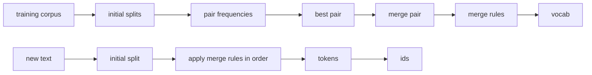

# Day 02: Naive BPE Tokenizer

Day01 解决的是 tokenizer 的最小闭环：

```text
text -> tokens -> ids -> tokens -> text
```

Day02 进入现代 subword tokenizer 的主菜：BPE, Byte Pair Encoding。

今天不先用 Hugging Face `AutoTokenizer`，也不直接读 Qwen tokenizer。今天先手写一个足够小、足够透明的 Naive BPE，让你亲眼看到：

```text
初始字符 tokens
  -> 统计相邻 pair
  -> 找最高频 pair
  -> merge pair
  -> 保存 merge rules
  -> 用 merge rules encode 新文本
```

BPE 不是语法算法，也不是按人类词法规则切词。它是统计合并算法。

## Why BPE

Day01 的两个 tokenizer 都有硬伤：

| Tokenizer | Problem |
| --- | --- |
| `CharTokenizer` | 不太 OOV，但序列太长。 |
| `WordTokenizer` | 序列较短，但 OOV 太严重。 |

BPE 的折中是：

```text
高频片段合并成更大的 token
低频词保留为更小的片段
```

所以它能把：

```text
tokenization
```

切成类似：

```text
token / ization
```

或者：

```text
token / iz / ation
```

具体怎么切，不由人类语法决定，而由训练语料里的 pair 频率和 merge rules 决定。

## Module Split

Day02 建议包含三个文件：

```text
day02_bpe_tokenizer/
├── __init__.py
├── README.md
├── naive_bpe.py
└── run_demo.py
```

职责边界：

| File | Role |
| --- | --- |
| `naive_bpe.py` | 手写 Naive BPE 的核心算法。 |
| `run_demo.py` | 展示训练过程、merge rules、encode 新文本的结果。 |
| `README.md` | 说明算法边界、工业对照和 review checklist。 |

今天不要引入 byte-level BPE，不要接 Hugging Face tokenizer 文件，不要下载模型。工业实现只做概念对照。

## Data Flow



Day02 要重点理解两条路径：

1. 训练路径：从 corpus 学出 `merges` 和 `vocab`。
2. 编码路径：对新文本按已学习的 `merges` 顺序合并。

## Facade Interface

建议你写一个 `NaiveBPETokenizer`，接口先保持接近 Day01：

```python
class NaiveBPETokenizer:
    unk_token: str
    unk_token_id: int

    @property
    def vocab_size(self) -> int: ...

    def train(self, corpus: list[str], num_merges: int) -> None: ...

    def tokenize(self, text: str) -> list[str]: ...

    def encode(self, text: str) -> list[int]: ...

    def decode(self, ids: list[int]) -> str: ...

    def convert_tokens_to_ids(self, tokens: list[str]) -> list[int]: ...

    def convert_ids_to_tokens(self, ids: list[int]) -> list[str]: ...
```

Day02 可以先不做 `<bos>/<eos>/<pad>`，只保留 `<unk>`。原因是今天的重点是 BPE merge，而不是 chat 序列结构。

如果你想保持 Day01 API 完全一致，也可以保留四个 special tokens。但不要让 special tokens 干扰 BPE 的训练逻辑。

## Core Data Structures

建议内部至少有这些字段：

```python
self.token_to_id: dict[str, int]
self.id_to_token: dict[int, str]
self.merges: list[tuple[str, str]]
```

`merges` 只保存 pair：

```python
[("l", "o"), ("lo", "w"), ("e", "r")]
```

是否额外保存 merge 后的 token：

```python
("l", "o") -> "lo"
```

可以由 `pair[0] + pair[1]` 推出，所以 Day02 不必复杂化。

## Training Algorithm

最小训练流程：

```text
1. 把 corpus 中每个词拆成字符序列
2. 统计所有相邻 pair 的频率
3. 选择频率最高的 pair
4. 把所有出现该 pair 的地方合并成新 token
5. 把 pair 追加到 merge rules
6. 把新 token 加入 vocab
7. 重复 num_merges 次
```

建议第一版用最经典玩具语料：

```python
corpus = ["low", "lower", "lowest"]
```

初始：

```text
l o w
l o w e r
l o w e s t
```

可能学到：

```text
l + o -> lo
lo + w -> low
e + r -> er
e + s -> es
es + t -> est
```

具体顺序取决于你的 tie-break 规则。只要规则稳定，就可以接受。

## Tie-Break Rule

BPE 经常会遇到多个 pair 频率相同。

Day02 必须显式定义 tie-break，否则测试会不稳定。

建议规则：

```text
先按 frequency 降序
再按 pair 字典序升序
```

也就是：

```python
best_pair = min(
    pair_freqs.items(),
    key=lambda item: (-item[1], item[0]),
)[0]
```

工业实现也会关心 tie-break。Hugging Face 课程里提到，同样语料用 `train_new_from_iterator()` 不一定得到完全相同 vocab，因为内部 tie-break 可能基于 tokenizer 的内部 id。

## Encoding Algorithm

训练完成后，`tokenize(text)` 不应该重新统计 pair。

它应该：

```text
1. 把新文本拆成初始字符 tokens
2. 按训练得到的 merges 顺序依次扫描
3. 遇到 matching pair 就合并
4. 返回最终 tokens
```

例如 merges 是：

```python
[("l", "o"), ("lo", "w")]
```

输入：

```text
lowest
```

流程：

```text
l o w e s t
lo w e s t
low e s t
```

注意：encode 新文本时不能“现场学习新 merge”。训练和推理必须分开。

## What To Observe

跑 Day02 demo 时要看这些现象：

1. 初始 vocab 是字符级。
2. 每轮最高频 pair 被合并成一个新 token。
3. `merges` 是有顺序的，不是普通 set。
4. 相同文本在 merge rules 变多时，token 数会下降。
5. BPE 能缓解 word-level OOV，但 char-level base vocab 外的字符仍可能 OOV。
6. Naive BPE 还不是 byte-level BPE，所以它不能保证任何 Unicode 文本都可编码。

## Demo Requirements

`run_demo.py` 至少输出：

| Column | Meaning |
| --- | --- |
| `step` | 第几轮 merge。 |
| `best_pair` | 本轮合并的最高频 pair。 |
| `frequency` | pair 频率。 |
| `new_token` | 合并后产生的新 token。 |
| `splits` | 当前 corpus 的 token 序列状态。 |

然后再对测试文本输出：

| Column | Meaning |
| --- | --- |
| `text` | 原始文本。 |
| `tokens` | BPE tokenize 后的 token 列表。 |
| `ids` | encode 后的 id 列表。 |
| `decoded` | decode 结果。 |

建议测试文本：

```python
TEST_TEXTS = [
    "low",
    "lower",
    "lowest",
    "slow",
    "tokenizer",
]
```

其中 `slow` 可以观察未知字符或未充分 merge 的行为，`tokenizer` 可以观察 toy corpus 下泛化能力很弱。

## Tests To Add

新增：

```text
tests/
└── test_day02_bpe_tokenizer.py
```

最少测试这些：

1. `compute_pair_freqs()` 能正确统计 pair。
2. `merge_pair()` 能合并所有匹配 pair。
3. `train()` 会记录稳定顺序的 merge rules。
4. `tokenize()` 会按已学习 merge rules 编码新文本，而不是重新训练。
5. `encode()` 对 vocab 内 token 不产生 `<unk>`。
6. unknown char 会产生 `<unk>`，且 decode 不应静默删除。

## Review Checklist

我 review Day02 时会重点看：

1. 训练和推理是否分离。
2. `merges` 是否保持有序。
3. tie-break 是否稳定。
4. pair frequency 是否乘上词频，或者至少明确这是 unweighted toy version。
5. merge 时是否能处理连续重复 pair。
6. 是否避免了“每次 encode 都重新学习 merge”的错误。
7. 测试是否覆盖 tie-break 和 unknown path。

## Common Bugs

### 1. 重新训练新文本

错误：

```text
tokenize(new_text) 时重新统计 new_text 的 pair 并学习 merge
```

正确：

```text
train(corpus) 学 merge rules
tokenize(new_text) 只应用已有 merge rules
```

### 2. 把 `merges` 存成 set

错误：

```python
self.merges = {("l", "o"), ("lo", "w")}
```

正确：

```python
self.merges = [("l", "o"), ("lo", "w")]
```

BPE merge rules 的顺序会影响结果。

### 3. merge 连续 pair 时跳错 index

例如：

```text
a a a
```

merge `a + a -> aa` 时，结果应该是：

```text
aa a
```

而不是：

```text
aa aa
```

因为原始中间那个 `a` 不能同时参与两次 merge。

### 4. 忽略 tie-break

如果 pair 频率相同但选择不稳定，测试和 demo 每次都可能不同。Day02 必须有确定性。

## Industrial References

Day02 的 Naive BPE 是教学版，工业实现会复杂很多：

1. Hugging Face 课程把 BPE 训练拆成：先做 normalization / pre-tokenization，再建 base vocabulary，然后反复学习最高频 merge rules；新文本 tokenization 则按学到的 merge rules 顺序应用。
2. Hugging Face `tokenizers.models.BPE` 的模型参数包括 `vocab`、`merges`、`cache_capacity`、`dropout`、`unk_token`、subword prefix/suffix、`byte_fallback` 等；它也支持从 `vocab.json` 和 `merges.txt` 加载 BPE 模型。
3. OpenAI `tiktoken` 是 fast BPE tokeniser，并且带有 `_educational` 子模块，可以训练简单 encoding 或可视化 BPE 过程。
4. Qwen2.5 的 Hugging Face 仓库里能直接看到 `merges.txt`、`vocab.json`、`tokenizer.json` 和 `tokenizer_config.json`。Day04/Day05 再读这些文件，不在 Day02 过早展开。

参考链接：

- [Hugging Face LLM Course: Byte-Pair Encoding tokenization](https://huggingface.co/learn/llm-course/chapter6/5)
- [Hugging Face Tokenizers BPE model API](https://huggingface.co/docs/tokenizers/api/models#tokenizers.models.BPE)
- [OpenAI tiktoken](https://github.com/openai/tiktoken)
- [Qwen2.5-0.5B-Instruct files](https://huggingface.co/Qwen/Qwen2.5-0.5B-Instruct/tree/main)

## Industrial BPE Q&A

### 工业 BPE 会像 Day02 这样全量扫、全量重算吗？

不会。

Day02 的实现是为了把算法讲清楚：

```text
每轮 merge
  -> 全量统计 pair
  -> 全量选择最高频 pair
  -> 全量更新 splits
```

这在小语料上很好理解，但在真实训练语料上会非常慢。

### 工业实现是不是简单用“分治法”？

不只是分治。

更准确地说，工业 BPE 通常是一组工程策略组合：

```text
pre-tokenization
词频压缩
增量 pair frequency 更新
heap / priority queue
分块并行统计
Rust / C++ 实现
encode 缓存
byte-level / byte fallback
```

### 什么是 pre-tokenization？

工业 tokenizer 通常不会让 BPE 在整篇文档上无限跨越合并，而是先把文本切成较小片段。

例如代码：

```text
def get_user_profile(user_id):
```

可能先被 pre-tokenizer 切成类似：

```text
def / get / _ / user / _ / profile / ( / user / _ / id / ) / :
```

然后 BPE 在这些片段内部或按规则约束后的范围内合并。

### 什么是词频压缩？

真实语料里会有大量重复词或重复片段。工业训练不会保存每一行的完整 split 再反复扫描，而会先统计频率。

例如：

```python
{
    ("l", "o", "w"): 1000,
    ("l", "o", "w", "e", "r"): 300,
    ("l", "o", "w", "e", "s", "t"): 200,
}
```

统计 pair 时不是简单 `+1`，而是乘上词频：

```text
("l", "o") += word_freq
```

Day02 当前是 unweighted toy version，后面如果要更接近工业训练，可以把 splits 从 `list[list[str]]` 升级成“token sequence + frequency”。

### 为什么要增量更新 pair frequency？

Day02 每轮 merge 后会重新统计所有 pair。

工业实现会尽量只更新受影响的局部 pair。

例如：

```text
a b c
```

如果合并：

```text
a b -> ab
```

真正变化的是附近这些 pair：

```text
左邻居 + a
a + b
b + 右邻居
左邻居 + ab
ab + 右邻居
```

不需要每轮都重新扫完整语料。

### 为什么要用 heap / priority queue？

如果 pair 种类很多，每轮都遍历所有 pair 找最高频会很慢。

工业实现通常会把 pair 放进优先队列，快速取最高频 pair。

不过这会引入一个新问题：heap 里可能有过期条目。某个 pair 的频率已经因为前面的 merge 变化了，但旧频率还在 heap 里，所以取出来时需要校验。

### 并行化在哪里发生？

pair 统计可以按语料块并行：

```text
chunk 1 -> local pair counts
chunk 2 -> local pair counts
chunk 3 -> local pair counts
merge local counts -> global pair counts
```

这有点像 map-reduce，但 tokenizer 工程里通常会说 chunking、sharding、parallel aggregation，而不只说分治。

### 为什么工业实现常用 Rust / C++？

因为 tokenizer 是高频路径。

训练时要扫海量语料；推理时每次请求都要 encode prompt、decode output。Python 适合教学和 glue code，不适合在这个路径上承担全部性能压力。

Hugging Face `tokenizers` 的核心是 Rust，SentencePiece 是 C++，OpenAI `tiktoken` 也走 fast BPE tokeniser 路线。

### 工业 encode 阶段还会优化什么？

常见优化包括：

1. 对常见 token 片段做缓存。
2. 批量处理多个输入。
3. 快速处理 special tokens。
4. 快速 padding / truncation。
5. byte-level 或 byte fallback 保证 Unicode 覆盖。

Day02 的 Naive BPE 还不能保证所有 Unicode 文本都可编码。这个问题留到 Day03 byte-level BPE。

### Day02 和工业实现的关系是什么？

Day02 只保留算法骨架：

```text
pair frequency
best pair
merge rule
ordered merges
apply merges
```

工业实现是在这个骨架上加性能、并行、缓存、Unicode 覆盖、文件格式和 chat template。

## Day02 Self Check

下面是 Day02 收工前的自测题。重点不是背 BPE 名词，而是能不能解释训练阶段和编码阶段的边界。

### 1. BPE 相比 `CharTokenizer` 和 `WordTokenizer` 分别解决了什么问题？

`CharTokenizer` 不容易 OOV，但序列太长。`WordTokenizer` 序列较短，但 OOV 爆炸。

BPE 是折中：

```text
高频片段合并成更大的 token
低频词拆成更小的 token
```

所以它既能减少纯字符级的序列长度，又能缓解纯词级的 OOV。

### 2. `compute_pair_freqs()` 统计的 pair 是什么？

pair 是两个相邻 token 的 tuple，不一定永远是字符。

训练一开始是字符 pair：

```python
["l", "o", "w", "e", "r"]
```

会统计：

```python
("l", "o")
("o", "w")
("w", "e")
("e", "r")
```

但 merge 以后，token 可能已经是 `"lo"`、`"low"` 这种子词片段，所以后续 pair 可能是：

```python
("lo", "w")
("low", "e")
```

### 3. 为什么 `merges` 必须是 `list[tuple[str, str]]`，不能是 `set`？

因为 merge rules 的顺序会影响结果。

例如：

```python
[("l", "o"), ("lo", "w")]
```

可以把：

```text
l o w
```

合成：

```text
low
```

但如果顺序变成：

```python
[("lo", "w"), ("l", "o")]
```

第一步时文本里还没有 `"lo"`，所以合并结果就不同。

`set` 不能表达这个顺序语义，因此不适合保存 BPE merge rules。

### 4. 为什么 `tokenize(new_text)` 不能重新调用 `compute_pair_freqs()` 和 `select_best_pair()`？

因为 `tokenize(new_text)` 是编码/推理阶段，不是训练阶段。

训练阶段负责从 corpus 学到：

```python
self.merges
self.token_to_id
```

编码阶段只能应用这些已经学到的规则。否则每个新输入都会临时改变 tokenizer，导致同一个模型面对不同请求时使用不同 tokenization 规则，这在工程上不可接受。

### 5. 为什么 `merge_pair_in_sequence(["a", "a", "a"], ("a", "a"))` 的结果是 `["aa", "a"]`？

因为一次 merge 中，同一个原始 token 不能同时参与两次合并。

从左到右扫描：

```text
a a a
^ ^
```

前两个 `a a` 合并成 `aa` 后，index 跳 2，只剩第三个 `a`：

```text
aa a
```

所以结果是：

```python
["aa", "a"]
```

不是：

```python
["aa", "aa"]
```

### 6. 为什么 `train(["low", "lower", "lowest"], 5)` 的第 3 个 merge 是 `("low", "e")`？

前两轮后，splits 变成：

```python
["low"]
["low", "e", "r"]
["low", "e", "s", "t"]
```

此时 pair frequency 是：

```python
("low", "e"): 2
("e", "r"): 1
("e", "s"): 1
("s", "t"): 1
```

所以第 3 轮最高频 pair 是：

```python
("low", "e")
```

BPE 每轮只合并一个 pair，因此不会一步直接得到 `"lowest"`。

### 7. `select_best_pair()` 里的 tie-break 为什么重要？

tie-break 是为了确定性。

多个 pair 频率相同时，如果不规定选谁，不同运行、不同 Python 版本、不同实现可能学出不同 merge rules。这样 demo、测试、模型文件都不可复现。

Day02 的规则是：

```text
frequency 降序
pair 字典序升序
```

### 8. `train()` 开头为什么要重置状态？

因为同一个 tokenizer 对象可能被重复训练。

如果不重置：

```python
self.token_to_id
self.id_to_token
self.merges
self.training_steps
```

第二次训练会继承第一次训练的词表和 merge rules，导致结果被污染。

### 9. 为什么 `tokenize("slow")` 得到 `["s", "low"]` 是 BPE 的优势？

因为训练语料里虽然没有完整词 `"slow"`，但学到了高频片段 `"low"`。

BPE 可以复用已学到的子词片段：

```text
slow -> s / low
```

这比 WordTokenizer 把整个 `"slow"` 变成 `<unk>` 更稳，也比 CharTokenizer 拆成 `s / l / o / w` 更短。

### 10. 为什么 toy corpus 下 `"tokenizer"` 会出现很多 `<unk>`？

因为 Day02 的 Naive BPE base vocab 只来自训练 corpus 的字符。

如果训练语料是：

```python
["low", "lower", "lowest"]
```

那么字符 `k`、`n`、`i`、`z` 都没出现过。输入 `"tokenizer"` 时，这些字符没有对应 token id，就会变成 `<unk>`。

这说明 Naive BPE 仍然有覆盖性问题。工业 tokenizer 通常会用 byte-level 或 byte fallback 来减少甚至避免这种 OOV。

### 11. 工业 BPE 为什么不会像 Day02 这样每轮全量重新统计 pair？

因为真实语料太大，全量重算成本太高。

常见优化方向包括：

```text
词频压缩
分块并行统计
增量更新 pair frequency
heap / priority queue 选最高频 pair
Rust / C++ 实现
缓存常见 encode 结果
byte-level / byte fallback
```

工业优化不是简单“堆内存”，而是减少无效计算、改善数据结构、并行化和使用系统语言实现高频路径。

### 12. byte-level BPE 要解决 Naive BPE 的哪个最大问题？

覆盖性。

Naive BPE 的 base vocab 来自训练 corpus 的字符。如果新文本出现训练时没见过的字符，就会 `<unk>`。

byte-level BPE 先把文本变成 byte 序列，再在 byte 层面做 BPE。这样任意 Unicode 文本最终都能落到 byte 表示上，包括 emoji、生僻字、混合语言和奇怪符号。

这就是 Day03 的核心问题：

```text
如何让 tokenizer 尽量不因为没见过某个字符就 OOV？
```

## Day02 Exit Criteria

今天结束时，应该能做到：

1. 你能手写解释 `pair_freqs` 是什么。
2. 你能说明 `merge rules` 为什么必须有顺序。
3. 你能区分 BPE 的训练阶段和编码阶段。
4. 你能解释为什么 BPE 不是语法切词。
5. `scripts/test.ps1` 通过 Day01 + Day02 测试。
6. `scripts/run_day02.ps1` 能展示每一轮 merge 和最终 encode 结果。

达成这些以后，Day03 才进入 byte-level BPE，解决 Unicode 覆盖和 byte fallback 的问题。
