# Day 03: Byte-level BPE

Day02 的 Naive BPE 还有一个大问题：base vocab 来自训练语料里的字符。

如果训练语料是：

```python
["low", "lower", "lowest"]
```

那么新文本：

```text
tokenizer
😀
𠮷
```

里面没见过的字符仍然会变成 `<unk>`。

Day03 解决这个问题：先把文本转成 UTF-8 bytes，再在 byte token 上做 BPE。

核心数据流从 Day02 的：

```text
text -> chars -> BPE merges -> ids
```

变成：

```text
text -> UTF-8 bytes -> byte tokens -> BPE merges -> ids
```

## Why Bytes

Unicode 字符空间非常大，直接把所有字符放进初始 vocab 不现实。

但 byte 只有 256 种：

```text
0x00 ... 0xFF
```

任意 Unicode 文本都可以编码成 UTF-8 bytes：

```python
"A".encode("utf-8")      # b"A"
"你".encode("utf-8")     # b"\xe4\xbd\xa0"
"😀".encode("utf-8")     # b"\xf0\x9f\x98\x80"
```

所以 byte-level tokenizer 可以用 256 个 byte token 作为 base vocab。这样即使没见过某个字符，也可以退回到 byte 表示，而不是直接 `<unk>`。

## Module Split

Day03 建议包含：

```text
day03_byte_bpe/
├── __init__.py
├── README.md
├── byte_bpe.py
└── run_demo.py
```

职责边界：

| File | Role |
| --- | --- |
| `byte_bpe.py` | byte-level BPE 的核心数据结构和教学版实现。 |
| `run_demo.py` | 展示 text -> bytes -> text 的可逆性，以及后续 byte BPE 结果。 |
| `README.md` | 解释为什么 bytes 能解决覆盖性问题。 |

## Day03 Learning Plan

Day03 分两小步。

### Step 1: UTF-8 byte roundtrip

先只实现：

```python
text_to_byte_tokens(text: str) -> list[bytes]
byte_tokens_to_text(tokens: list[bytes]) -> str
format_byte_token(token: bytes) -> str
```

目标：

```python
text = "你好😀"
tokens = text_to_byte_tokens(text)
decoded = byte_tokens_to_text(tokens)
assert decoded == text
```

你今天第一眼要看到：

```text
"你" 不是一个 byte
"😀" 也不是一个 byte
```

它们会被 UTF-8 拆成多个 bytes。

### Step 2: BPE over byte tokens

把 Day02 的 BPE 算法迁移到 `bytes` token：

```python
BytePair = tuple[bytes, bytes]
ByteTokenSequence = list[bytes]
```

merge 规则从：

```python
("l", "o") -> "lo"
```

变成：

```python
(b"l", b"o") -> b"lo"
```

也就是直接拼接 bytes：

```python
new_token = pair[0] + pair[1]
```

## Data Flow

```mermaid
flowchart LR
    A["text"] --> B["text.encode('utf-8')"]
    B --> C["single-byte tokens"]
    C --> D["BPE pair frequencies"]
    D --> E["ordered byte merges"]
    E --> F["byte tokens"]
    F --> G["token ids"]
    G --> H["byte tokens"]
    H --> I["b''.join(tokens)"]
    I --> J["decode utf-8"]
    J --> K["text"]
```



## Facade Interface

建议最终写一个 `ByteLevelBPETokenizer`：

```python
class ByteLevelBPETokenizer:
    @property
    def vocab_size(self) -> int: ...

    def train(self, corpus: list[str], num_merges: int) -> None: ...

    def tokenize(self, text: str) -> list[bytes]: ...

    def encode(self, text: str) -> list[int]: ...

    def decode(self, ids: list[int]) -> str: ...

    def convert_tokens_to_ids(self, tokens: list[bytes]) -> list[int]: ...

    def convert_ids_to_tokens(self, ids: list[int]) -> list[bytes]: ...
```

Day03 先不做 GPT-2 的 byte-to-unicode 可视化映射。我们先用 `bytes` 对象作为内部 token，这样算法更清楚。

## Important Difference From Day02

Day02:

```python
self.token_to_id: dict[str, int]
self.id_to_token: dict[int, str]
```

Day03:

```python
self.token_to_id: dict[bytes, int]
self.id_to_token: dict[int, bytes]
```

Day02 可能有 `<unk>`。

Day03 如果把 256 个 single-byte token 都加入初始 vocab，就不需要因为未知字符产生 `<unk>`。未知 Unicode 字符会被拆成它自己的 UTF-8 byte 序列。

## Clarification: Is It Just `encode("utf-8")`?

可以这么直觉理解，但要更精确一点。

Day03 不是简单“多一个 `encode='utf-8'` 参数”，而是 tokenizer 的底层 token 单位变了：

```text
Day02: token 是 str
Day03: token 是 bytes
```

也就是说，BPE 操作对象从字符片段变成 byte 片段。

Day02:

```python
list("你好😀")
# ["你", "好", "😀"]
```

Day03:

```python
raw = "你好😀".encode("utf-8")
tokens = [bytes([value]) for value in raw]
```

结果类似：

```python
[
    b"\xe4", b"\xbd", b"\xa0",
    b"\xe5", b"\xa5", b"\xbd",
    b"\xf0", b"\x9f", b"\x98", b"\x80",
]
```

所以 UTF-8 发生在两个关键位置。

### 1. Train / Tokenize 的入口

训练时输入仍然是：

```python
corpus: list[str]
```

但每条文本都先变成 UTF-8 bytes：

```python
raw = text.encode("utf-8")
tokens = [bytes([value]) for value in raw]
```

后续 BPE merge 发生在 bytes token 上：

```python
(b"\xe4", b"\xbd") -> b"\xe4\xbd"
```

而不是：

```python
("你", "好") -> "你好"
```

### 2. Decode 的出口

decode 时不能逐 token decode。

错误方式：

```python
b"\xe4".decode("utf-8")
```

单个 byte 可能不是完整 UTF-8 字符，所以会报错。

正确方式：

```python
raw = b"".join(tokens)
text = raw.decode("utf-8")
```

必须先把 byte tokens 拼回完整 byte stream，再 decode 成字符串。

### 3. 类型变化

Day02:

```python
token_to_id: dict[str, int]
id_to_token: dict[int, str]
Pair = tuple[str, str]
```

Day03:

```python
token_to_id: dict[bytes, int]
id_to_token: dict[int, bytes]
BytePair = tuple[bytes, bytes]
```

一句话总结：

> Day03 是把 BPE 的最小单位从“字符”下沉到“UTF-8 byte”，从而解决没见过字符就 `<unk>` 的覆盖性问题。

## What To Observe

重点观察：

1. 英文 ASCII 字符通常是 1 byte。
2. 中文通常是 3 bytes。
3. emoji 通常是 4 bytes。
4. byte-level base vocab 只有 256 个基础 token。
5. BPE merge 后 token 可以是多个 bytes 的片段。
6. decode 时必须先拼回 bytes，再 UTF-8 decode。

## Demo Requirements

`run_demo.py` 第一阶段先展示 byte roundtrip：

| Column | Meaning |
| --- | --- |
| `text` | 原始文本。 |
| `utf8_hex` | `text.encode("utf-8").hex(" ")` 的结果。 |
| `byte_tokens_hex` | 单 byte token 的十六进制列表。 |
| `formatted` | 人类可读的 byte token 显示。 |
| `decoded` | byte tokens 拼回文本。 |

建议测试：

```python
TEXTS = [
    "hello",
    "你好",
    "hello你好",
    "😀",
    "Agent🤖",
]
```

## Tests To Add

Day03 至少测试：

1. ASCII roundtrip。
2. 中文 roundtrip。
3. emoji roundtrip。
4. `text_to_byte_tokens("A") == [b"A"]`。
5. `len(text_to_byte_tokens("你")) == 3`。
6. `len(text_to_byte_tokens("😀")) == 4`。
7. byte-level tokenizer 初始 vocab 包含 256 个 byte tokens。
8. byte-level tokenizer 对未见 Unicode 字符不应产生 `<unk>`。

## Common Bugs

### 1. 把 Unicode 字符和 byte 混为一谈

错误理解：

```text
"你" 是一个 token，所以也是一个 byte
```

正确理解：

```python
"你".encode("utf-8") == b"\xe4\xbd\xa0"
```

它是 3 个 bytes。

### 2. decode 时逐 token 解码

错误：

```python
[b"\xe4", b"\xbd", b"\xa0"] 每个 token 单独 decode
```

单个 byte 可能不是合法 UTF-8 字符。

正确：

```python
b"".join(tokens).decode("utf-8")
```

必须先拼回完整 byte stream，再 decode。

### 3. 训练和推理混在一起

和 Day02 一样，训练阶段学 byte merges，推理阶段只应用已有 byte merges。

### 4. 以为 byte-level BPE 没有任何复杂性

byte-level 解决了覆盖性，但带来了可读性和 decode 复杂度。真实 GPT-2 / tiktoken 这类实现还会做 byte-to-unicode 映射、正则 pre-tokenization、special tokens 和缓存。

## Industrial Connection

GPT-2 风格 BPE 的关键变化之一就是 byte-level：先把文本转成 bytes，再用可逆映射把 bytes 显示成 Unicode 字符参与 BPE。这样能避免传统字符 vocab 遇到未知 Unicode 字符时直接 OOV。

OpenAI `tiktoken` 和 Hugging Face fast tokenizers 都在这个方向上做了大量工程优化，但 Day03 只保留最小可解释版本：

```text
Unicode text
  -> UTF-8 bytes
  -> byte tokens
  -> BPE merge
  -> ids
```

## Day03 Exit Criteria

今天结束时至少要做到：

1. 能解释为什么 byte base vocab 是 256。
2. 能说明为什么中文/emoji 会变成多个 bytes。
3. 能完成 text -> byte tokens -> text 的 roundtrip。
4. 能解释为什么 byte-level BPE 比 Naive BPE 更少 `<unk>`。
5. 能说明 decode 时为什么要先 `b"".join(tokens)` 再 `.decode("utf-8")`。
