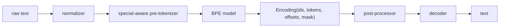

# Day 04: HF-style Tokenizer Pipeline

Day01 到 Day03 都在手搓 tokenizer 的局部能力：

```text
Day01: char / word tokenizer
Day02: naive BPE
Day03: byte-level BPE
```

Day04 开始进入真正工业 tokenizer 的形状：不是一个大函数，而是一条 pipeline。

Hugging Face `tokenizers` 的核心组件可以概括成：

```text
normalizer
  -> pre-tokenizer
  -> model
  -> post-processor
  -> decoder
```

今天我们不调用 Hugging Face 库，而是按这个边界手搓一个小版。

## Why Pipeline

真实 tokenizer 不只是“词表 + BPE 算法”。

它需要同时处理：

```text
Unicode normalization
pre-tokenization
BPE / WordPiece / Unigram model
added special tokens
post processing
decoder
offsets
chat template
padding / truncation
```

Qwen、DeepSeek-R1-Distill-Qwen、Llama、GLM 这些模型的 tokenizer 文件里，通常也能看到这些信息分散在：

```text
tokenizer.json
tokenizer_config.json
special_tokens_map.json
vocab.json
merges.txt
tokenizer.model
tokenization_*.py
```

## Module Split

```text
day04_hf_style_tokenizer/
├── core.py
├── normalizers.py
├── pre_tokenizers.py
├── models.py
├── post_processors.py
├── decoders.py
├── tokenizer.py
├── chat_template.py
├── factory.py
└── run_demo.py
```

职责边界：

| File | Role |
| --- | --- |
| `core.py` | `Encoding`、`PreToken`、`ChatMessage` 等共享数据结构。 |
| `normalizers.py` | 文本标准化组件。 |
| `pre_tokenizers.py` | 文本切成 pre-token，并保留 special token 原子性。 |
| `models.py` | BPE model，只负责 bytes -> BPE tokens -> ids。 |
| `post_processors.py` | 插入 BOS/EOS 等后处理 special tokens。 |
| `decoders.py` | token bytes -> text。 |
| `tokenizer.py` | 串联整个 pipeline。 |
| `chat_template.py` | Qwen-like messages -> prompt。 |
| `factory.py` | 组装一个 Qwen-like 教学 tokenizer。 |

## Data Flow



## Industrial References

Day04 的结构参考这些公开实现和文档：

1. Hugging Face `tokenizers` 文档把 tokenizer 拆成 normalizer、pre-tokenizer、model、post-processor、decoder 等组件。
2. Hugging Face BPE model 支持 `vocab`、`merges`、`unk_token`、cache、dropout、byte fallback 等参数。
3. Qwen2.5 Hugging Face 仓库包含 `tokenizer.json`、`tokenizer_config.json`、`vocab.json`、`merges.txt` 等文件，并使用 `<|im_start|>` / `<|im_end|>` 风格的 chat 边界。
4. DeepSeek-R1-Distill-Qwen 是 Qwen 蒸馏系模型，适合观察“模型权重不同，但 tokenizer 可能继承底座体系”的现象。

参考链接：

- [Hugging Face Tokenizers components](https://huggingface.co/docs/tokenizers/components)
- [Hugging Face Tokenizers BPE model API](https://huggingface.co/docs/tokenizers/api/models#tokenizers.models.BPE)
- [Qwen2.5-0.5B-Instruct files](https://huggingface.co/Qwen/Qwen2.5-0.5B-Instruct/tree/main)
- [DeepSeek-R1-Distill-Qwen-1.5B files](https://huggingface.co/deepseek-ai/DeepSeek-R1-Distill-Qwen-1.5B/tree/main)

## Key Lessons

### 1. Special tokens must be atomic

错误：

```text
<|im_start|> -> "<" / "|" / "im" / "_start" / "|" / ">"
```

正确：

```text
<|im_start|> -> one added special token
```

所以 Day04 有 `SpecialAwarePreTokenizer`。

### 2. BPE model should not know chat roles

`BPEModel` 只负责 bytes 和 merge rules。它不应该知道什么是 `system/user/assistant`。

chat role 的处理应该在 `chat_template.py`。

### 3. Decoder is a separate component

encode 不是 decode 的简单反向循环。byte-level token 必须先拼回 bytes，再 UTF-8 decode。

### 4. Encoding carries metadata

工业 tokenizer 不只返回 ids，还会返回：

```text
tokens
offsets
special_tokens_mask
attention_mask
type_ids
```

Day04 的 `Encoding` 先保留 ids、tokens、offsets 和 special mask。

## Day04 Exit Criteria

今天结束时，应该能做到：

1. 解释 HF tokenizer pipeline 的组件边界。
2. 说明 special token 为什么必须 atomic。
3. 说明 chat template 为什么不应该塞进 BPE model。
4. 跑通 Qwen-like chat template encode/decode。
5. `scripts/test.ps1` 通过 Day01-Day04 测试。
